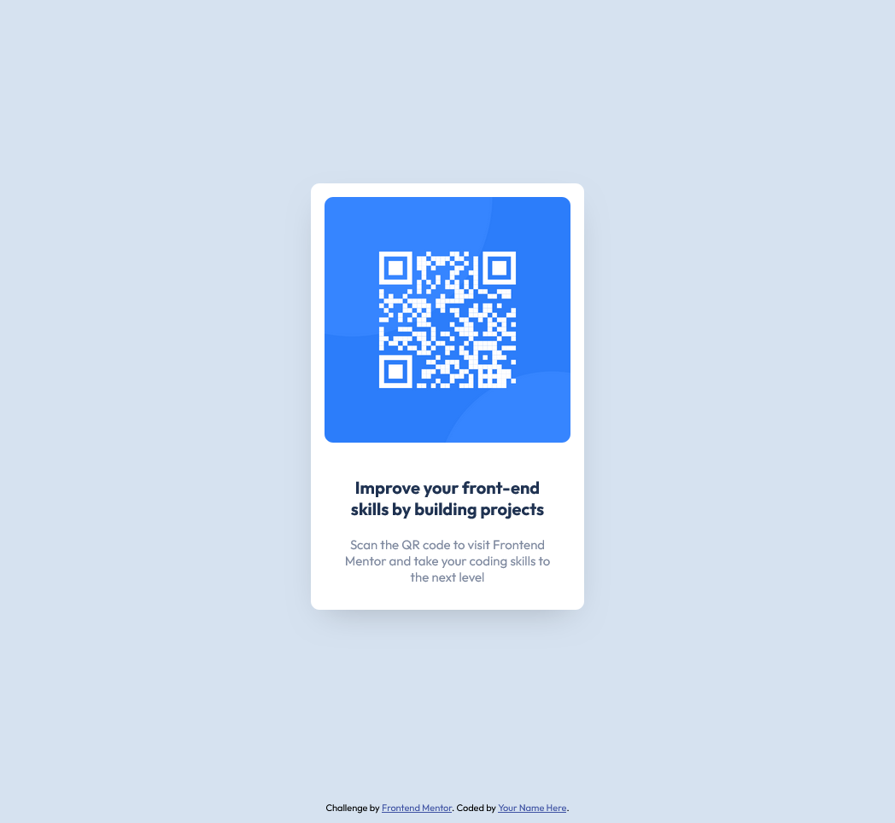

# Frontend Mentor - QR code component solution

This is a solution to the [QR code component challenge on Frontend Mentor](https://www.frontendmentor.io/challenges/qr-code-component-iux_sIO_H). Frontend Mentor challenges help you improve your coding skills by building realistic projects. 

## Table of contents

- [Overview](#overview)
  - [Screenshot](#screenshot)
  - [Links](#links)
- [My process](#my-process)
  - [Built with](#built-with)
  - [Steps](#steps)
  - [What I learned](#what-i-learned)
  - [Useful resources](#useful-resources)
- [Author](#author)

## Overview

### Screenshot



### Links

- Solution URL: [QR-Code Component](https://sergiocely10.github.io/qr-code-component/)

## My process

### Built with

- HTML
- CSS - Sass
- Flexbox
- CSS Animation

### Steps
- I analyze the design and identified the different elements from it.
- Then, I defined the HTML but only containers and text elements, not images.
- I coded the first CSS styles to have my initial sketch.
- Using Flexbox help me to organize and to distribute the elements: QR component and footer.
- When everything looks great, I added the QR image in the QR component.
- Finally, I added last details like margins, paddings, colors, fonts, shadows and animations.

### What I learned

With this project I learned how to do a sticky footer using flexbox, understading a bit better flexbox
property like flex-wrap. 

```html
<!DOCTYPE html>
<html>
  <head></head>
  <body>
    <section class="component"></section>
    <footer class="attribution"></footer>
  </body>
</html>
```

```css
body {
    display: flex;
    flex-wrap: wrap;
}

.attribution {
    width: 100%;
    align-self: flex-end;
}
```

In this process, using Firefox Dev Tool help to identify how min-height affect each flex item.

I added a pair CSS animations: fade-in on page load and hover. For fade-in, I used @keyframes and for hover: transform and transitions properties. Because I wanted to have a smooth transition for hover action, I neeeded to add both properties to my qr component as my qr component hover. 

```css
/* Hover  */
.component {
    transform: scale(1);
    transition: .2s ease-in-out;
}

.component:hover{
    transform: scale(1.1);
    transition: .2s ease-in-out;
}

```


### Useful resources

- [Flexbox tips and examples](https://youtu.be/ZxuAc1Ye_VE?si=iXVCiuhFCkTP4irx) - This helped me for my sticky footer. reason.
- [Fade-in CSS](https://www.geeksforgeeks.org/how-to-create-fade-in-effect-on-page-load-using-css/)

## Author
- Frontend Mentor - [@sergiocely10](https://www.frontendmentor.io/profile/sergiocely10)
